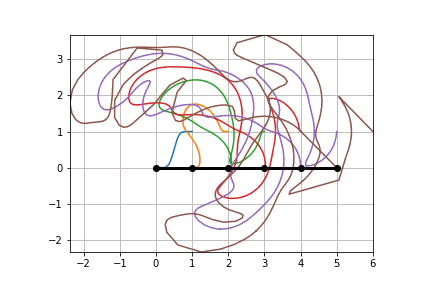
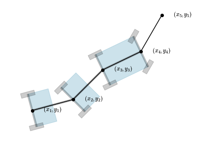

# Parking Frenzy

[Nicer animation](https://www.youtube.com/watch?v=t34qcpstTYk)

### Efficient maneuver computation for vehicles with many trailers

Explicit computation of control input for [non-holonomic](https://en.wikipedia.org/wiki/Nonholonomic_system) vehicles is a classical application example for the theory of [differential flatness](https://en.wikipedia.org/wiki/Flatness_(systems_theory)). In particular, it allows to determine the required steering profile of a car with trailers given the path profile that the last trailer axle should follow.

For instance, consider a car with two trailers. 

One may choose any (sufficiently differentiable) path  for the last trailer axle. From this path and its derivatives, all the other paths  can be computed explicitly. The angle between the link  and the link  is the required steering angle of the head car. Note also that the four-wheeled head car is equivalent to two two-wheeled trailers.

The equations are elementary, but naively applying them quickly leads to untractable expressions with growing numbers of trailers. 

### Recursive equations
The kinematics of the system implies the following equation

Using  and applying the above equation  times, we get a map

which allows to compute all trailer positions from the derivatives of the desired trajectory of .

However, doing so more than a few times (even using computer algebra) quickly leads to very large expressions and computation time. This is mainly due to the repeated derivatives of the square root term.

### Using angles

The first trick is to use additional angle variables by rewriting the recursive equation as follows

This is useful because from the first derivative of the arc-tangent we get

and this expression is rational in (no square roots). Hence, the multiple derivatives  of  can be computed from the derivatives of  by successively applying product rules and quotient rules. In turn, the derivatives of  and  are obtained by applying chain rules. These product-, quotient- and chain-rules are higher order variant of the usual ones (more on this below).

### More intermediate variables

The second trick is to decompose the mapping  in sub-steps involving more intermediate variables (the derivatives of all , not just ). Differentiating the original relation  ( times), gives a map

And

### High order product and quotient rules
Computing the derivatives of the angles  is easy: first compute the derivatives of the products

with the product rule and then compute the derivatives of the quotient of 

with the quotient rule. The product rule is given by

To get the quotient rule for , one first obtains a rule for the reciprocal . This rule is obtained from the product rule and the equation . The product rule is then applied again on .

Next define

then

This has two benefits: 1) the product rule uses simple coefficients convolution, 2) since high order derivatives tend to be numerically large, dividing them by  leads to better "conditioned " computations. Note that the above is the same as computing the coefficients of the product of polynomials with coefficients  and  and truncating the result at degree . The corresponding quotient rule is obtained in the same way as above.

### High order composition rule

To complete the computations of , we still need a high order composition rule to compute the derivatives of 

The first attempt was made using [Faa di Bruno's](https://en.wikipedia.org/wiki/Fa%C3%A0_di_Bruno%27s_formula) formula, in particular the form involving [Bell polynomials](https://en.wikipedia.org/wiki/Bell_polynomials#Recurrence_relations) since these can be easily implemented in code via a seemingly efficient recurrence relation. It turns out however that computing these polynomials this way quickly leads to very long computation times. I then stumbled on a [post](https://mathoverflow.net/questions/364036/combinatorics-of-multivariate-fa%C3%A0-di-bruno-formula) noting the "inefficiency" of Faa di Bruno formulae compared to power series approaches. Indeed, it is better to reconsider the problem from the point of view of formal power series. Our goal is to compute the first  derivatives of the composite function  (at a given value of )

To this end, let us look at the Taylor expansion of  around .

and then, let us replace  by its Taylor series around 

Clearly, defining the power series

we have that

Hence, computing the first  coefficients of the power series

we get the first  derivatives of . Furthermore, re-expressing everything in terms of  and  we get rid of the factorial terms and end up manipulating polynomials. In turn, the (truncated) composition of polynomials can be implemented using the product rule for building the monomials one by one.

### Animation speed

To produce an animation of a car with many trailers, one chooses a trajectory  for the last trailer's axle and then use the map  to compute all the other trailers and car positions. However doing so and using  leads to a jerky animation since the head car's speed generally varies wildly (high derivatives) over time. As a remedy, we impose the head car's rear axle speed (which can be computed from the derivatives of  by integration of the equation

### Note

Equations in this README file where typesetted with the help of [readme2tex](https://github.com/leegao/readme2tex)

